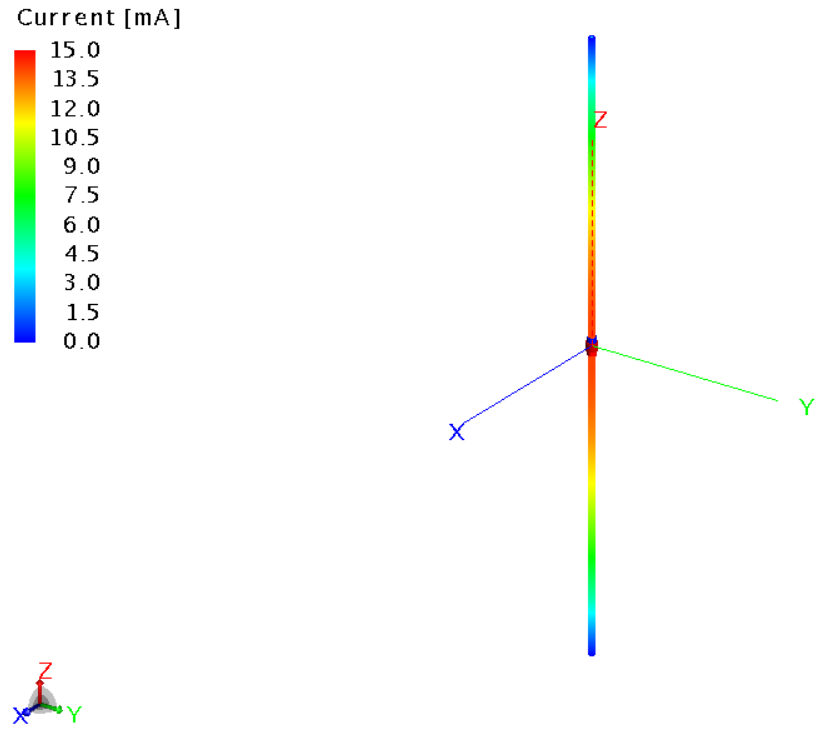
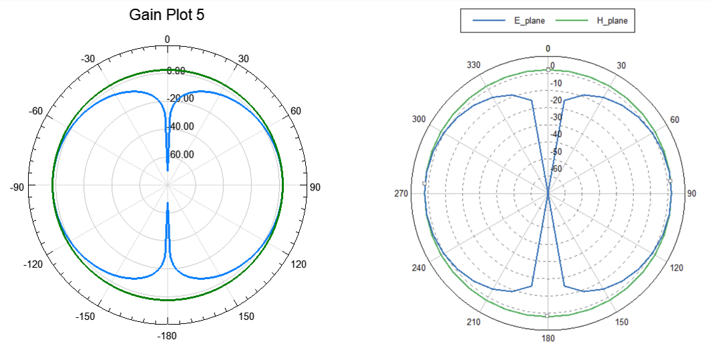
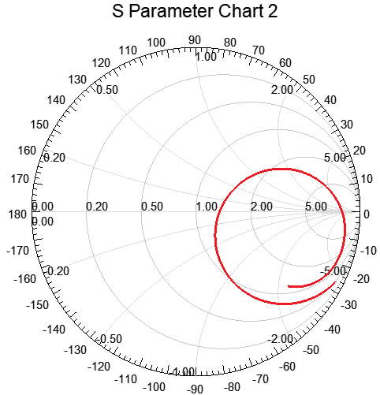
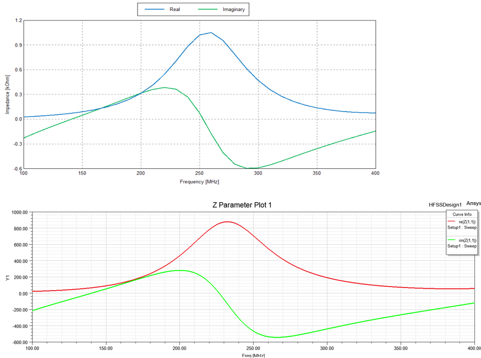
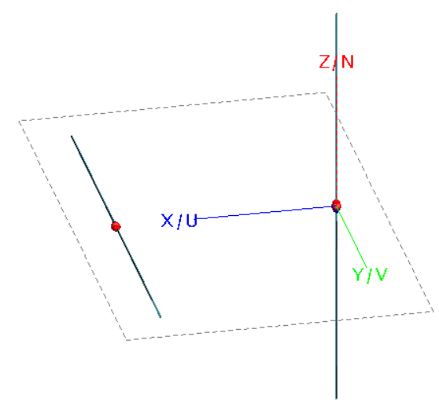
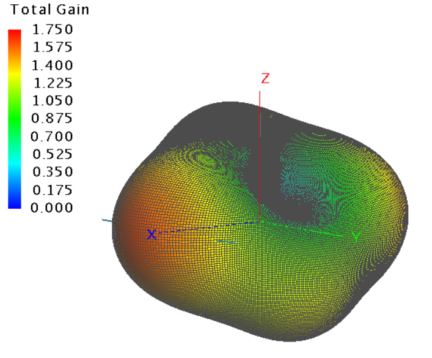
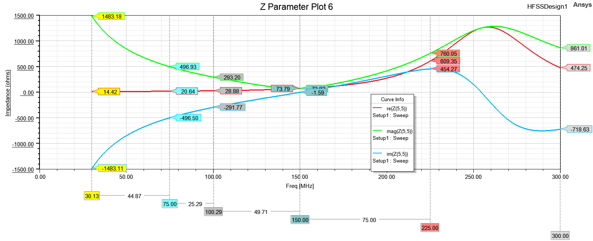
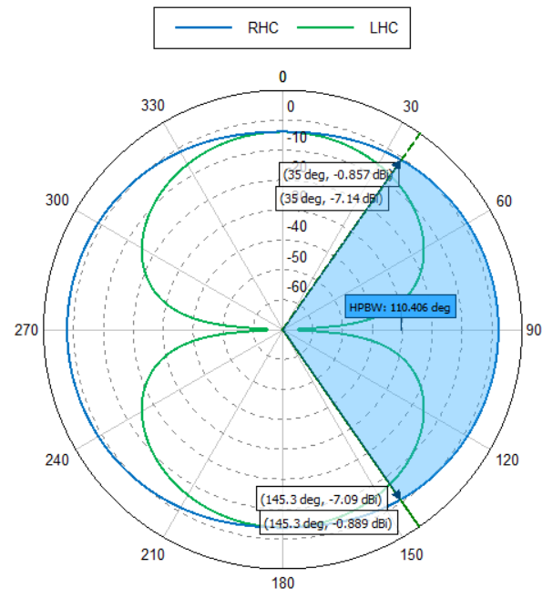

# 🚀 HFSS & FEKO Solutions  
### Electromagnetic Simulation Portfolio with Power Integrity Relevance

This repository contains **full-wave electromagnetic simulations** performed using  
**ANSYS HFSS** and **Altair FEKO**, with a focus on **antenna behavior, field interactions, and impedance characteristics** that are directly relevant to **power integrity (PI) and high-speed hardware design**.

While the primary structures are antennas, the analyses emphasize **current flow, impedance control, field coupling, and frequency-dependent behavior**—the same physical mechanisms that govern **PDN stability, resonance, EMI/EMC, and signal integrity** in real electronic systems.

---

## 🔹 Current Distribution Across a Dipole (FEKO)

Understanding **current distribution** is fundamental to power integrity engineering.  
This simulation visualizes how RF currents propagate and concentrate along a resonant dipole—analogous to **current crowding and standing-wave effects** observed in PDN planes, vias, and interconnects at high frequencies.

---

## 🔹 Dipole Radiation Patterns — HFSS vs FEKO

Cross-tool validation is a critical engineering practice.  
Here, far-field radiation patterns computed in **HFSS** and **FEKO** are compared to verify consistency, reinforcing confidence in **field solvers used for EMI prediction, enclosure coupling, and power-plane resonance analysis**.

---

## 🔹 Smith Chart Analysis of Dipole Impedance (HFSS)

Impedance control lies at the heart of power integrity.  
This Smith chart illustrates how antenna input impedance varies with frequency, closely paralleling **PDN impedance targets**, **decoupling strategies**, and **resonance avoidance** in high-speed boards.

---

## 🔹 Dipole Input Impedance Comparison — HFSS vs FEKO

Accurate impedance prediction is essential for preventing **power rail oscillations and EMI hotspots**.  
This comparison highlights solver agreement on both real and reactive impedance components, a key requirement when modeling **via inductance, package parasitics, and plane discontinuities**.

---

## 🔹 Frequency-Dependent Radiation Behavior (HFSS)

Power integrity problems are inherently frequency-dependent.  
This study demonstrates how radiation patterns and beamwidth change with frequency—mirroring how **PDN resonances emerge and shift across operating bands**, impacting noise coupling and compliance margins.

---

## 🔹 Cross-Polarized Dipole Configuration (3D Model)

Complex current paths and orthogonal field components are common in modern electronics.  
This 3D cross-polarized antenna model provides insight into **multi-axis coupling**, similar to interactions between **power, ground, and signal structures** in dense multilayer designs.

---

## 🔹 Cross-Polarized Antenna Radiation Pattern

The resulting radiation pattern reveals polarization isolation and field orientation effects—concepts directly transferable to **EMI suppression, return-path control, and minimizing unwanted coupling** in power-distribution networks.

---

## 🔹 Impendance, Magnitude and Phase trend in dipole across different frequencies in HFSS

---

## 🔹 Right Hand vs Left Hand Polarization (measuring half-power beamwidth in FEKO)

---
