# 🚀 HFSS & FEKO Solutions  
### Electromagnetic Simulation Portfolio with Power Integrity Relevance

This repository contains **full-wave electromagnetic simulations** performed using  
**ANSYS HFSS** and **Altair FEKO**, with a focus on **antenna behavior, field interactions, and impedance characteristics** that are directly relevant to **power integrity (PI) and high-speed hardware design**.

While the primary structures are antennas, the analyses emphasize **current flow, impedance control, field coupling, and frequency-dependent behavior**—the same physical mechanisms that govern **PDN stability, resonance, EMI/EMC, and signal integrity** in real electronic systems.

---

## 🔹 Current Distribution Across a Dipole (FEKO)

Understanding **current distribution** is fundamental to power integrity engineering.  
This simulation visualizes how RF currents propagate and concentrate along a resonant dipole—analogous to **current crowding and standing-wave effects** observed in PDN planes, vias, and interconnects at high frequencies.

---

## 🔹 Dipole Radiation Patterns — HFSS vs FEKO

Cross-tool validation is a critical engineering practice.  
Here, far-field radiation patterns computed in **HFSS** and **FEKO** are compared to verify consistency, reinforcing confidence in **field solvers used for EMI prediction, enclosure coupling, and power-plane resonance analysis**.

---

## 🔹 Smith Chart Analysis of Dipole Impedance (HFSS)

Impedance control lies at the heart of power integrity.  
This Smith chart illustrates how antenna input impedance varies with frequency, closely paralleling **PDN impedance targets**, **decoupling strategies**, and **resonance avoidance** in high-speed boards.

---

## 🔹 Dipole Input Impedance Comparison — HFSS vs FEKO

Accurate impedance prediction is essential for preventing **power rail oscillations and EMI hotspots**.  
This comparison highlights solver agreement on both real and reactive impedance components, a key requirement when modeling **via inductance, package parasitics, and plane discontinuities**.

---

## 🔹 Frequency-Dependent Radiation Behavior (HFSS)

Power integrity problems are inherently frequency-dependent.  
This study demonstrates how radiation patterns and beamwidth change with frequency—mirroring how **PDN resonances emerge and shift across operating bands**, impacting noise coupling and compliance margins.

---

## 🔹 Cross-Polarized Dipole Configuration (3D Model)

Complex current paths and orthogonal field components are common in modern electronics.  
This 3D cross-polarized antenna model provides insight into **multi-axis coupling**, similar to interactions between **power, ground, and signal structures** in dense multilayer designs.

---

## 🔹 Cross-Polarized Antenna Radiation Pattern

The resulting radiation pattern reveals polarization isolation and field orientation effects—concepts directly transferable to **EMI suppression, return-path control, and minimizing unwanted coupling** in power-distribution networks.

---

## 🔹 Impedance Magnitude and Phase Trend of a Dipole Across Frequency (HFSS)
This study examines the frequency-dependent impedance behavior of a dipole antenna using ANSYS HFSS, including both magnitude and phase variations across the operating band. The results highlight resonance behavior, impedance transitions, and phase reversal regions that are critical for matching, bandwidth estimation, and high-frequency signal integrity analysis in RF and mixed-signal systems.

---

## 🔹 Right-Hand vs Left-Hand Circular Polarization (Half-Power Beamwidth Analysis in FEKO)
This simulation compares right-hand circular polarization (RHCP) and left-hand circular polarization (LHCP) radiation characteristics using FEKO. The analysis focuses on half-power beamwidth (HPBW) and polarization-dependent radiation behavior, providing insight into polarization purity, coupling effects, and directional performance relevant to antenna-system integration and electromagnetic compatibility studies.

---

## 🔹 Radar Cross Section estimation of a sperical object in FEKO
This simulation investigates the radar cross section (RCS) of a perfectly conducting spherical target under different polarization conditions using FEKO. The results illustrate fundamental EM scattering mechanisms, polarization sensitivity, and angular response, which are directly applicable to EMI/EMC analysis, unintended radiation assessment, and high-frequency system modeling.

  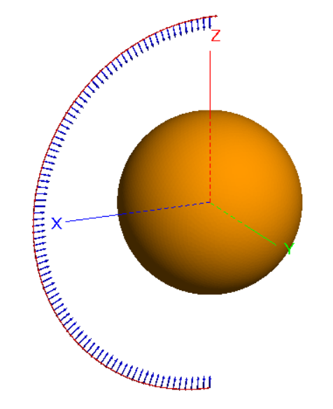
  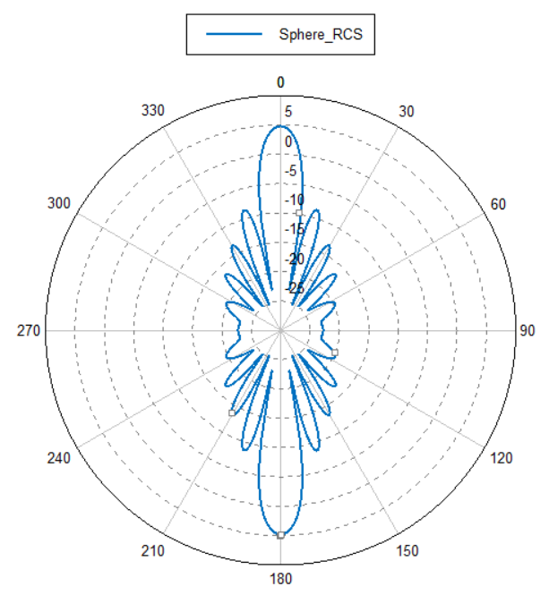

---

## 🔹 Radar Cross Section estimation of a square object in FEKO
This study extends the RCS analysis to a square conductive target, highlighting how geometry-induced discontinuities and edge diffraction affect scattering behavior. The comparison with spherical targets provides practical intuition for package, board, and enclosure-level EM scattering, which is critical in signal and power integrity analysis of complex electronic systems.

  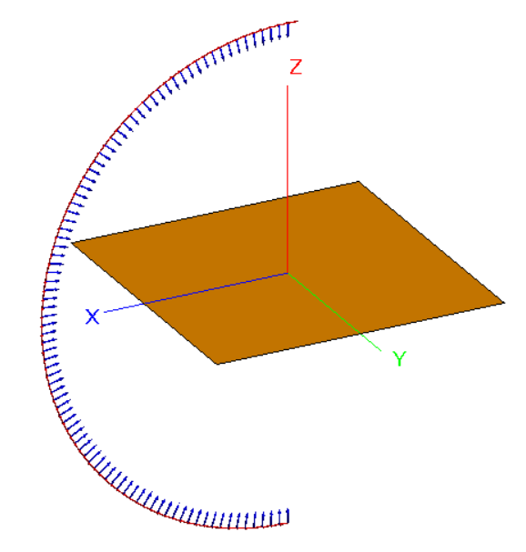
  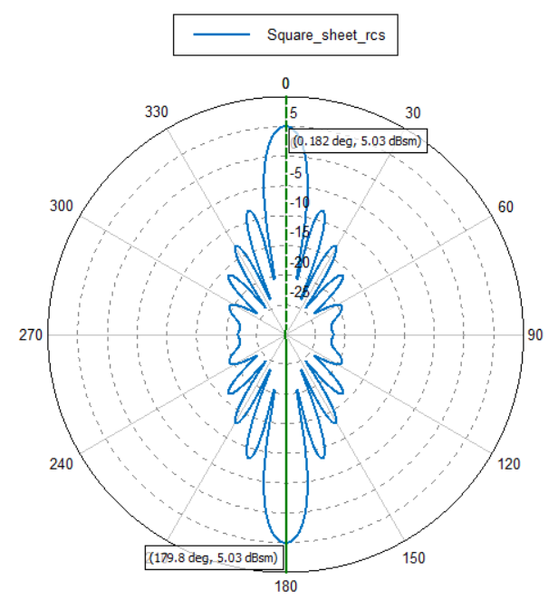

---

## 🔹 Dipole with Loading Plates in FEKO

Analying current distribution in different sections of the dipole with loading plates.

  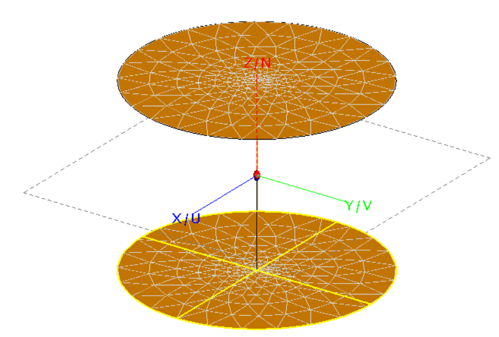
  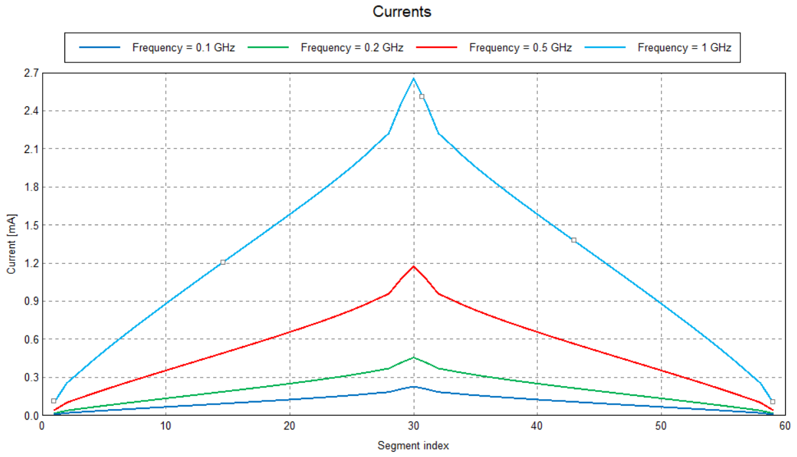

---

## 🔹 Dipole on a circular PEC plate

Radiation pattern of the dipole on a circular PEC plate with different radii.
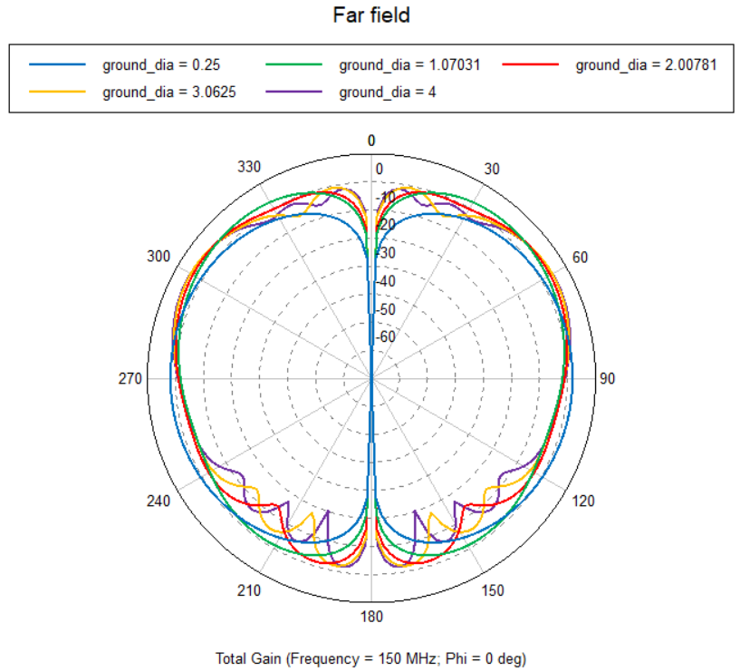

---

## 🔹 Circular loop antenna

Simulation and radiation pattern of circular loop antenna (with multiple with several input voltages along the loop).

  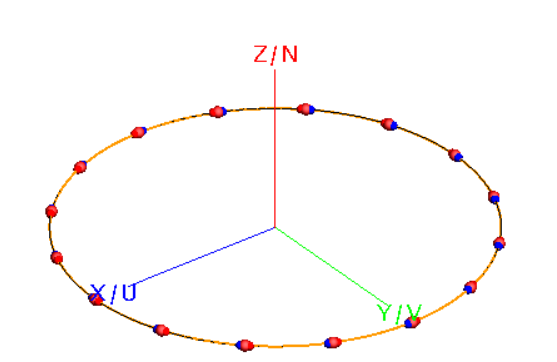
  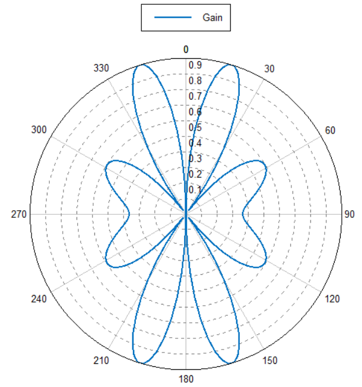

---

## 🔹 Cone Antenna in HFSS

Cone antenna simulation in HFSS, indicating the trend in impedance and radiation pattern for different frequencies.

  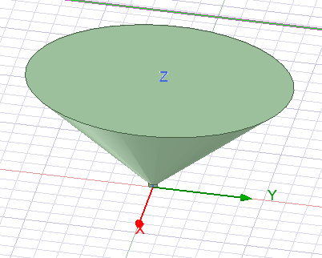
  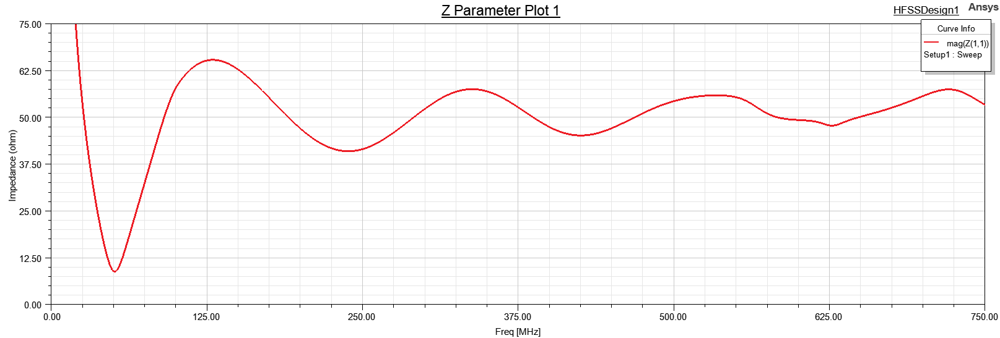
  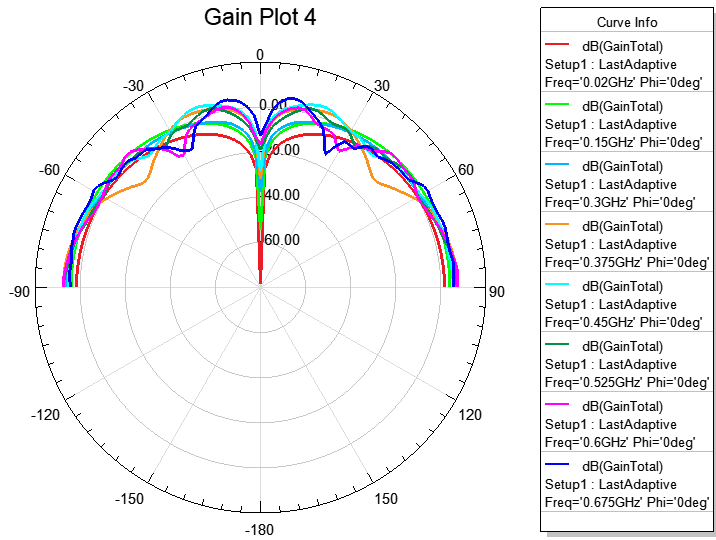

---

